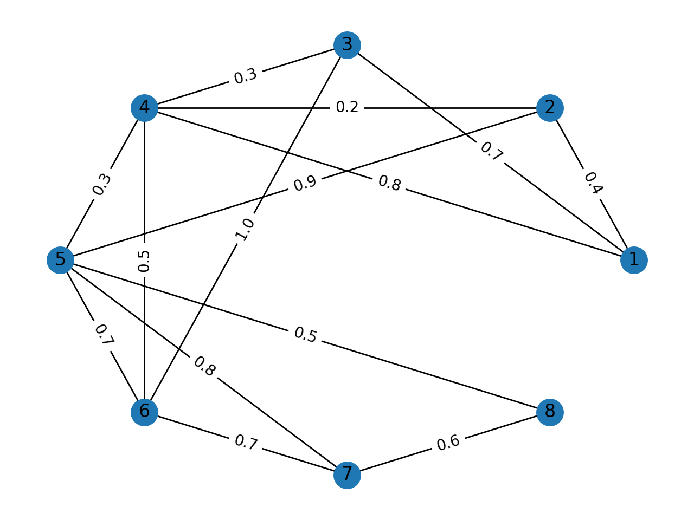
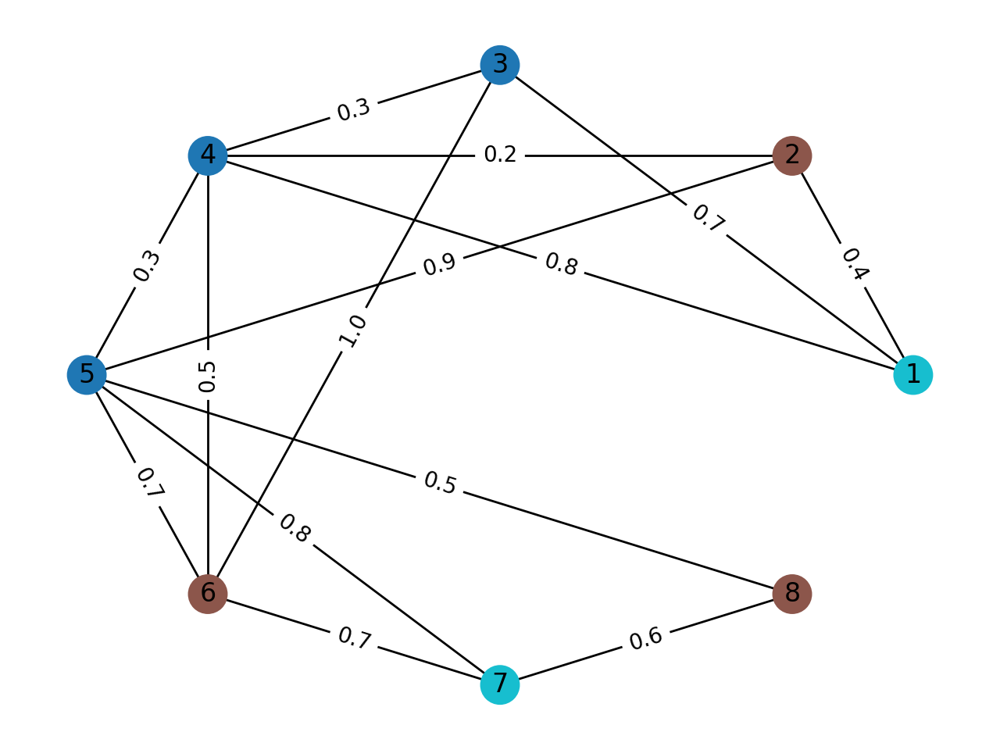

.. fuzzy-graph-coloring documentation master file, created by
   sphinx-quickstart on Tue Feb  8 14:25:54 2022.
   You can adapt this file completely to your liking, but it should at least
   contain the root `toctree` directive.

Welcome to fuzzy-graph-coloring's documentation!
************************************************

.. toctree::
   :maxdepth: 2
   :caption: Table of Contents

fuzzy-graph-coloring is a Python package for calculating
the fuzzy chromatic number and coloring of a graph with fuzzy edges.
It will create a coloring with a minimal amount of incompatible edges
using a genetic algorithm (:code:`genetic_fuzzy_color`) or a greedy-k-coloring (:code:`greedy_k_color`)
combined with a binary search (:code:`alpha_fuzzy_color`).

If you don't know which one to use, we recommend :code:`alpha_fuzzy_color`.
If you are looking for a networkX coloring but with a given k, use :code:`greedy_k_color`.

See repository https://github.com/ferdinand-dhbw/fuzzy-graph-coloring
See the paper that accompanied the project https://github.com/ferdinand-dhbw/fuzzy-graph-coloring/blob/main/docs/KoenigRheinerFGCStudentResearchProject2022.pdf

Indices and tables
==================

* :ref:`genindex`
* :ref:`modindex`
* :ref:`search`

Quick-Start
===========
Install package: :code:`pip install fuzzy-graph-coloring`

Consider the following graph:

Try simple code:

.. code-block::

   import fuzzy-graph-coloring as fgc

   TG2 = nx.Graph()
   TG2.add_edge(1, 2, weight=0.4)
   TG2.add_edge(1, 3, weight=0.7)
   TG2.add_edge(1, 4, weight=0.8)
   TG2.add_edge(2, 4, weight=0.2)
   TG2.add_edge(2, 5, weight=0.9)
   TG2.add_edge(3, 4, weight=0.3)
   TG2.add_edge(3, 6, weight=1.0)
   TG2.add_edge(4, 5, weight=0.3)
   TG2.add_edge(4, 6, weight=0.5)
   TG2.add_edge(5, 6, weight=0.7)
   TG2.add_edge(5, 7, weight=0.8)
   TG2.add_edge(5, 8, weight=0.5)
   TG2.add_edge(6, 7, weight=0.7)
   TG2.add_edge(7, 8, weight=0.6)

   print(fgc.alpha_fuzzy_color(TG2, 3, return_alpha=True, fair=True))

Result: :code:`{5: 0, 6: 1, 1: 2, 7: 2, 2: 1, 3: 0, 4: 0, 8: 1} 0.9285714285714286 0.4`

(Tuple of coloring, score [(1-DTI)], and alpha [of alpha-cut])

Public functions
================
.. automodule:: fuzzy_graph_coloring
   :members:

Bibliography
============
The project uses a lot of the by Keshavarz created basics:
E. Keshavarz, "Vertex-coloring of fuzzy graphs: A new approach," Journal of Intelligent & Fuzzy Systems, vol. 30, pp. 883-893, 2016, issn: 1875-8967. https://doi.org/10.3233/IFS-151810

License
=======
This project is licensed under GNU General Public License v3.0 (GNU GPLv3). See :code:`LICENSE` in the code repository.
